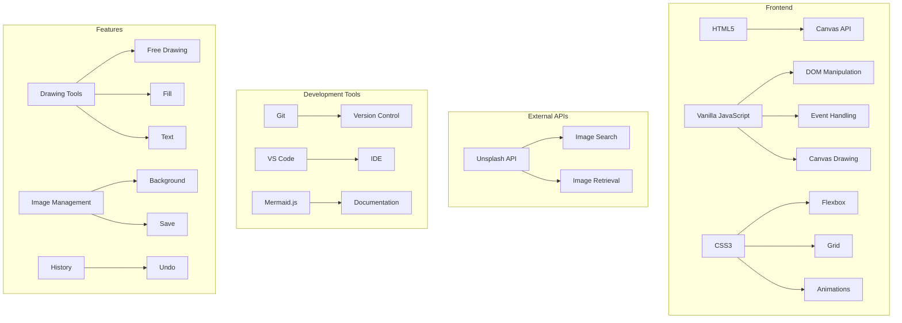
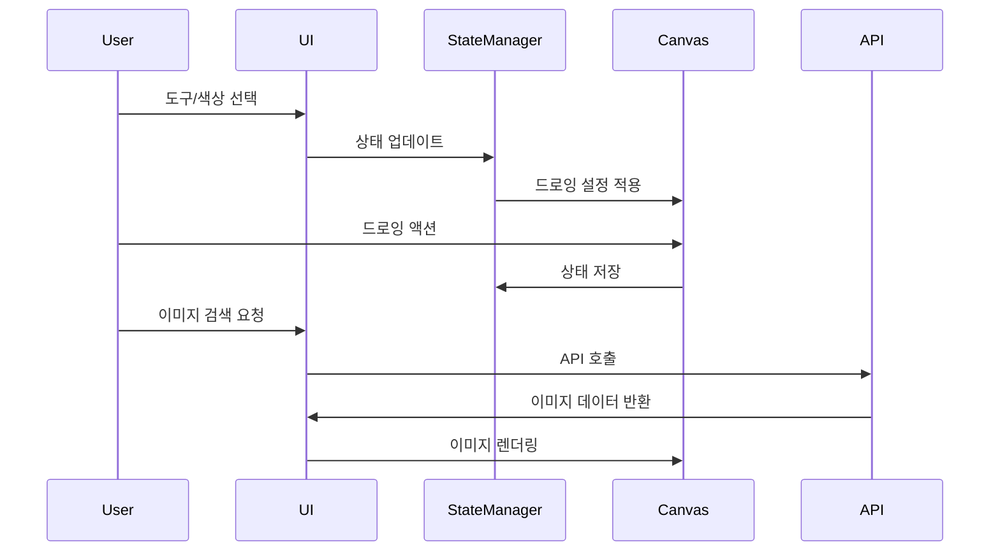

# Drawing App 🎨

Drawing App은 웹 브라우저에서 동작하는 직관적이고 다양한 기능을 갖춘 드로잉 애플리케이션입니다.

## 주요 기능 ✨

### 기본 드로잉 기능
- ✍️ 자유 드로잉
- 🎨 다양한 색상 선택
- 📏 선 두께 조절 (1-10px)
- ✋ DrawFill 모드 (채우면서 그리기)
- 📮 전체 화면 채우기

### 텍스트 및 이미지
- 👆 텍스트 삽입
- 🖼️ 배경 이미지 검색 및 적용 (Unsplash API 활용)
- ✚ 로컬 이미지 배경 적용

### 편집 도구
- ✊ 전체 지우기
- ❌ 지우개 기능
- 📲 작업 결과 이미지 저장

## 기술 스택 🛠

- HTML5 Canvas
- Vanilla JavaScript
- CSS3
- Unsplash API

## 사용 방법 📝

1. 시작 페이지에서 "Let's Start Drawing!" 버튼 클릭
2. 상단의 색상 팔레트에서 원하는 색상 선택
3. 선 두께 조절 슬라이더로 원하는 굵기 설정
4. 다양한 그리기 모드 선택:
   - Draw: 기본 그리기 모드
   - DrawFill: 채우면서 그리기 모드
   - FillScreen: 전체 화면 채우기
5. 추가 기능:
   - 텍스트 입력 후 TextFill 버튼으로 삽입
   - 배경 이미지 검색 및 적용
   - 로컬 이미지 업로드
   - 작업 결과 저장

## 시스템 아키텍처

